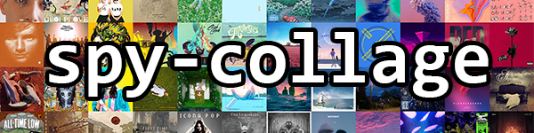

# spy-collage: Beautiful Album Art Collages for Spotify

[](http://mypy-lang.org/)
[](https://github.com/psf/black)

A configurable Python album art collage generator for Spotify with automatic album discovery and color clustering. Featuring a novel and fully generalized approach to album art arrangement within the collage, `spy-collage` allows for an infinite degree of customization in the final product. Create rainbows, cluster images around predefined colors, or a combination of both! With `spy-collage`, the choice is yours.


#### Samples:

- The classic rainbow: [horizontal_spectrum preset](https://github.com/stephanlensky/spy-collage/blob/main/images/horizontal_spectrum.jpg)
- Two distinct color clusters: [red_vs_blue preset](https://github.com/stephanlensky/spy-collage/blob/main/images/red_vs_blue.jpg)


## Installation

Note: this project requires Python>=3.9.

First, clone the repository:

```
git clone https://github.com/stephanlensky/spy-collage.git
```

Then install with [`poetry`](https://python-poetry.org/):

```
poetry install
```

Additionally, Spotify API credentials are required. After setting up an application on the [Spotify Developers](https://developer.spotify.com/) site, credentials must be set as environment variables. Before running the application, ensure that `SPOTIPY_CLIENT_ID` and `SPOTIPY_CLIENT_SECRET` are set appropriately.

## Usage

```
Usage: spy-collage [OPTIONS] [SOURCE]

  A configurable album art collage generator for Spotify, featuring album
  discovery and color clustering.

Arguments:
  [SOURCE]  Albums to generate the collage with. Either a single Spotify
            playlist URI or a text file containing one of: a list of playlist
            URIs, a list of album URIs, or a JSON list of albums collected
            from the Spotify API.

Options:
  -d, --dimensions COLLAGESIZE    Dimensions of the generated collage,
                                  specified as nxm  [required]
  -p, --preset TEXT               Color arrangement preset to use for
                                  generating the collage. Available presets
                                  are defined in presets.ini.  [required]
  --discover / --no-discover      Enable/disable automatic album discovery for
                                  singles  [default: no-discover]
  --market TEXT                   When discovering albums, only consider those
                                  available in this market  [default: US]
  --dedupe / --no-dedupe          Experimental: When fetching album art, skip
                                  albums whose art is identical to an already-
                                  fetched album  [default: no-dedupe]
  --save-album-uris               Save processed album URIs to albums.txt
  -r, --album-cover-resolution [small|medium|large]
                                  Resolution to download album covers at
                                  [default: medium]
  --install-completion [bash|zsh|fish|powershell|pwsh]
                                  Install completion for the specified shell.
  --show-completion [bash|zsh|fish|powershell|pwsh]
                                  Show completion for the specified shell, to
                                  copy it or customize the installation.
  --help                          Show this message and exit.
```

For example, to generate a 12x9 collage from `.\example_source_lists\selected_albums.txt` using the `horizontal_spectrum` preset and small art resolution:

```
poetry run spy-collage -r small -d 12x9 -p horizontal_spectrum .\example_source_lists\selected_albums.txt
```
